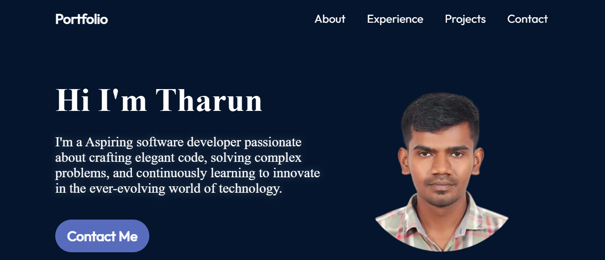
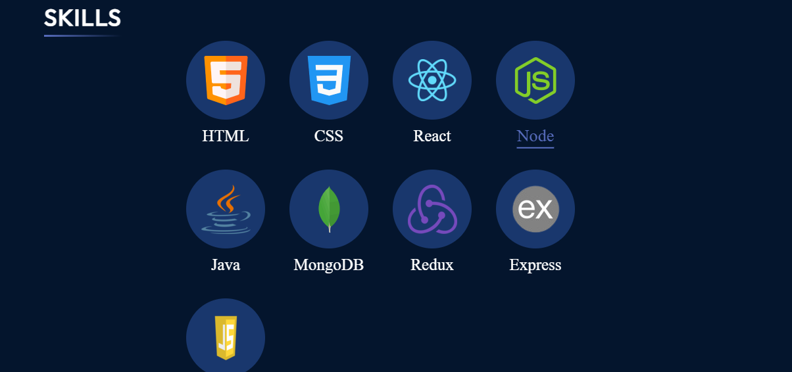
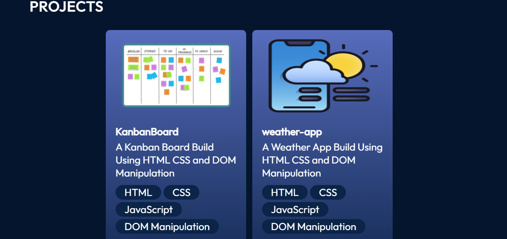
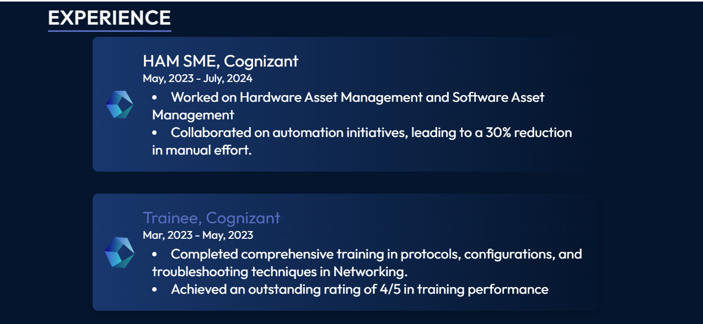

# My Portfolio

This is my personal portfolio website built with ReactJS and CSS Modules. The portfolio is fully responsive and optimized for various devices. It includes sections like Home (Hero), About, Skills, Experience, and Contact, allowing visitors to learn more about me and my work.

## 📸 Preview







## 🌟 Features

- **Responsive Design**: Works seamlessly on desktops, tablets, and mobile devices.
- **Navigation Bar**: Smooth navigation across sections.
- **Hero Section**: Eye-catching introduction with a brief intro.
- **About Section**: A short bio with personal details.
- **Skills Section**: Highlights key technical skills.
- **Experience Section**: Overview of work and projects.
- **Contact Section**: Form to get in touch via email.

## 🛠️ Technologies Used

- **ReactJS**: For building the interactive UI.
- **CSS Modules**: Scoped styling for each component.
- **JavaScript (ES6+)**: Core language for logic and interactivity.

## 📂 Project Structure

```plaintext
project-root/
├── public/
│   ├── index.html
├── src/
│   ├── components/
│   │   ├── Navbar/
│   │   ├── Hero/
│   │   ├── About/
│   │   ├── Skills/
│   │   ├── Experience/
│   │   ├── Contact/
│   ├── App.js
│   ├── index.js
│   ├── styles/
│       ├── variables.module.css
│       ├── global.module.css
│   └── assets/ (for images, icons, etc.)
├── .gitignore
├── package.json
└── README.md
```

## 🚀 Getting Started

To run this project locally, follow these steps:

### Prerequisites

Ensure you have [Node.js](https://nodejs.org/) installed.

### Installation

1. Clone this repository:
   ```bash
   git clone https://github.com/Tharun-Balaji/my-portfolio.git
   ```
2. Navigate to the project directory:
   ```bash
   cd portfolio
   ```
3. Install dependencies:
   ```bash
   npm install
   ```

### Running the Project

```bash
npm start
```

The app should now be running on [http://localhost:3000](http://localhost:3000).

## 📬 Contact

Feel free to reach out through the Contact section on the website or via email at [tharunbalaji110@gmail.com](mailto:[tharunbalaji110@gmail.com).
