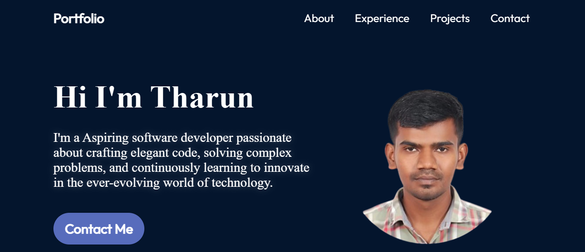
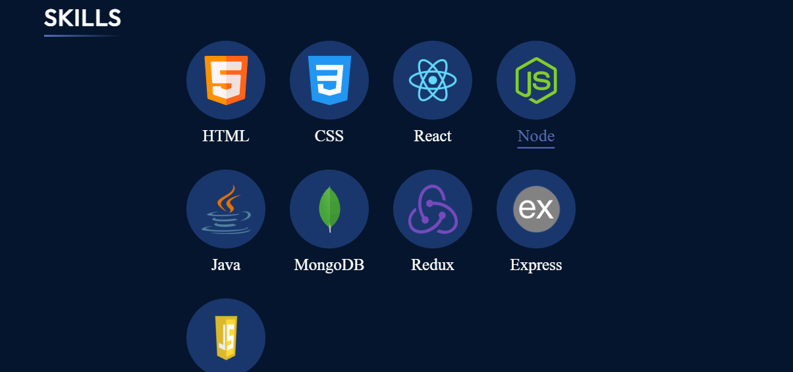
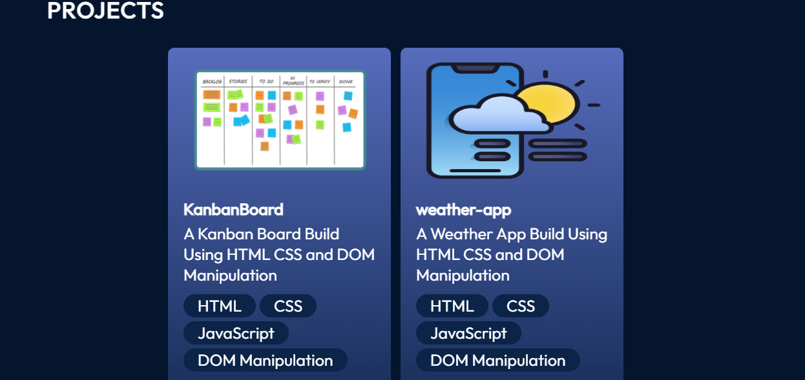
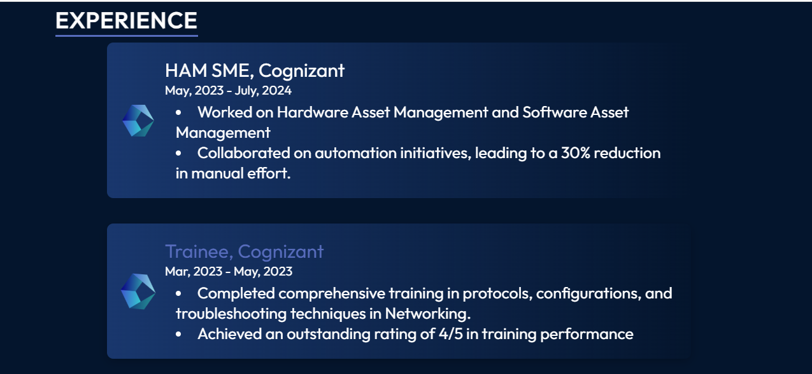
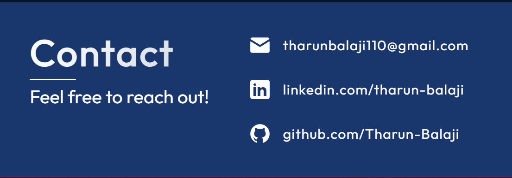

# My Portfolio

This is my personal portfolio website built with **Astro + React islands + CSS Modules**.

- Static sections are rendered with Astro for fast page loads.
- Interactive behavior (mobile nav menu) is kept in React.
- The site is responsive across desktop, tablet, and mobile screens.

## 📸 Preview







## 🌟 Features

- **Responsive Design** across devices.
- **React Navbar Island** for menu toggle interaction.
- **Astro-rendered static sections** for Hero, About, Skills, Experience, Projects, and Contact.
- **CSS Modules** for scoped component styles.

## 🛠️ Technologies Used

- **Astro**
- **React** (only for reactive parts)
- **CSS Modules**
- **JavaScript (ES6+)**

## 📂 Project Structure

```plaintext
project-root/
├── public/
│   └── assets/
├── src/
│   ├── components/
│   │   ├── Navbar/             # React interactive island
│   │   ├── Hero/               # Astro
│   │   ├── About/              # Astro
│   │   ├── skills/             # Astro
│   │   ├── Experience/         # Astro
│   │   ├── Projects/           # Astro
│   │   └── Contact/            # Astro
│   ├── layouts/
│   ├── pages/
│   └── data/
├── astro.config.mjs
├── package.json
└── README.md
```

## 🚀 Getting Started

### Prerequisites

- Node.js 18+

### Installation

```bash
npm install
```

### Run locally

```bash
npm run dev
```

The app runs by default at [http://localhost:4321](http://localhost:4321).

## ☁️ Deploy on Cloudflare Pages (Free)

Yes, you can deploy this portfolio for free using Cloudflare Pages.

### Cloudflare Pages build settings

- **Framework preset:** Astro (or None)
- **Build command:** `npm run build`
- **Build output directory:** `dist`

### Steps

1. Push your code to GitHub.
2. In Cloudflare dashboard, go to **Pages** → **Create project**.
3. Connect your GitHub repository.
4. Set the build settings above.
5. Deploy.

Cloudflare Pages free tier is enough for a personal portfolio (global CDN, SSL, custom domain).

## 📬 Contact

- Email: [tharunbalaji110@gmail.com](mailto:tharunbalaji110@gmail.com)
- LinkedIn: [linkedin.com/tharun-balaji](https://www.linkedin.com/in/tharun-balaji-j-a65402260/)

## Workflow

Workflow rules are documented in `AGENTS.md`.
